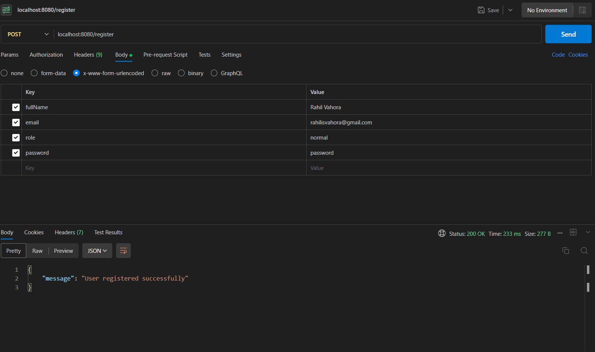
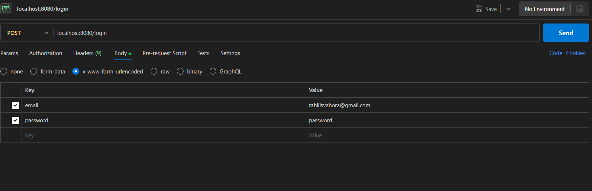
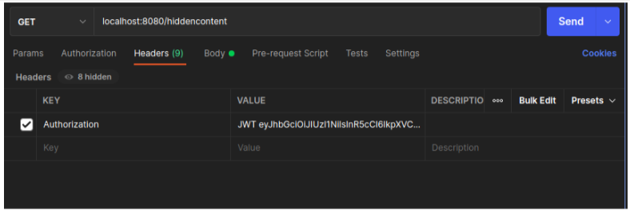
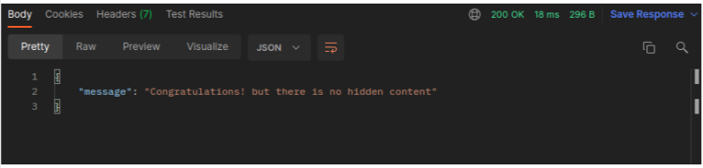

# JWT Authentication and Authorization in Express API 

## Introduction

This project demonstrates the implementation of JWT (JSON Web Tokens) for authentication and authorization in an Express API. The article covers the basics of JWT, its structure, and how to implement user registration, login, and access control using Express, MongoDB, and JWT.

## Testing 🚀

1. **Register User:**

   

2. **Login and Get Token:**

   

3. **Access Hidden Content with Token:**

   
   

## Project Setup

1. Ensure Node.js is installed.
2. Create a project folder and run `npm init -y` in the terminal.
3. Install required packages:

   ```bash
   npm i express mongoose jsonwebtoken bcrypt dotenv --save
   npm i nodemon -D
   ```

4. Create an `.env` file for environment variables (e.g., PORT=8080, API_SECRET=YourSecretString).

## Database Setup (MongoDB)

1. Install MongoDB or use the cloud version.
2. Start MongoDB (e.g., `sudo systemctl start mongod`).
3. Connect Express to the database in `app.js`.

## User Schema

Create a user schema in `models/user.js` with fields: fullName, email, role, password, and created timestamp.

## Authentication Controllers

Implement signup and signin controllers in `controllers/auth.controller.js`. Use bcrypt for password hashing and JWT for token creation.

## API Routes

Define API routes for user registration and login in `routes/user.js`. Use the controllers from `auth.controller.js`.

## Middleware for Authorization

Create a middleware `authJWT.js` in the `middlewares` folder for token verification and user authorization.

## Hidden Content Route

Define a protected route `/hiddencontent` in `routes/user.js` that requires a valid token for access.

## Usage

1. Run the Express server: `nodemon app.js`.
2. Use Postman to test user registration, login, and access to hidden content.

## Conclusion

This project successfully implements JWT authentication and authorization in an Express API. It covers user registration, login, and access control to protected routes. Feel free to explore and extend the functionality based on your requirements.